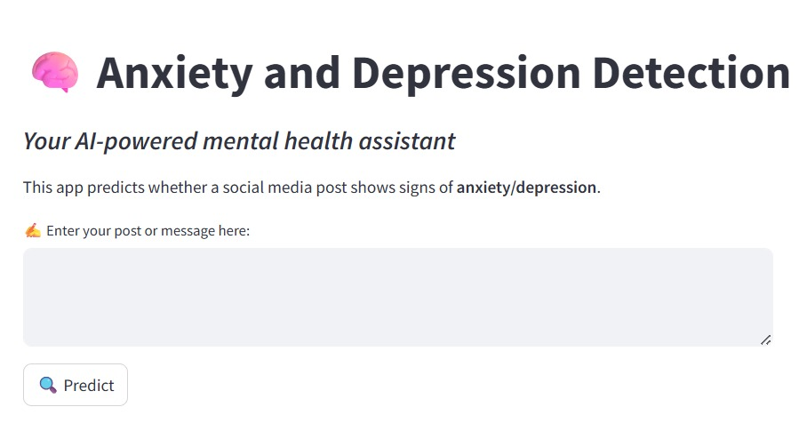

# Anxiety and Depression Detection from Social Media Posts

This project focuses on detecting signs of **anxiety** or **depression** in social media posts using **Machine Learning (ML)** and **Natural Language Processing (NLP)**. The goal is to support early mental health awareness by classifying text posts as either **"Normal"** or **"Anxiety/Depression"**.

## 📁 Project Structure

```
Anxiety_Depression_Classifier_Project/
│
├── app.py # Streamlit app for live prediction
├── best_anxiety_depression_model.pkl # Trained ML model (SVC)
├── tfidf_vectorizer.pkl # Saved TF-IDF vectorizer
├── model_training.ipynb # Jupyter notebook with training code
├── requirements.txt # List of required Python packages
├── README.md # Project overview and usage instructions
└── demo_screenshots

```
## ⚙️ Technologies Used

- **Python 3.x**
- **Scikit-learn** for model building
- **Streamlit** for building the web interface
- **Pandas** and **NumPy** for data handling
- **Matplotlib** for plotting 
- **Joblib** for saving and loading the model

## 🔧 How to Set Up and Run the App

### 1. Clone or Download the Project

git clone https://github.com/your-username/your-repo-name.git
cd your-repo-name

### Install Required Packages
```
pip install -r requirements.txt

```
### Run the Streamlit App
```
streamlit run app.py

```
This will open the app in your browser at http://localhost:8501.

## 📂 Dataset

We used a publicly available dataset of social media posts labeled for anxiety and depression.

**Source**: [Anxiety and Depression Detection Dataset on GitHub]
(https://github.com/swcwang/depression-detection/blob/master/data/tweets_combined.csv)

- Class 0 → Normal  
- Class 1 → Anxiety/Depression

The dataset was used to train multiple machine learning models, and the best-performing model (SVC) was saved for deployment.

## 📊 Model Details
Algorithm Used: Support Vector Classifier (SVC)
Vectorization: TF-IDF (Term Frequency-Inverse Document Frequency)
Dataset: Pre-labelled social media posts
Classes: 0 = Normal, 1 = Anxiety/Depression


## ✅ Model Performance
| Metric    | Score  |
| --------- | ------ |
| Accuracy  | 77.77% |
| Precision | 75.92% |
| Recall    | 77.77% |


The SVC model gave the best performance and was selected as the final classifier.

## 🖼️ Demo Screenshot

Here is a preview of the web interface:



## 📄 License
This project is for academic and demonstration purposes only.
